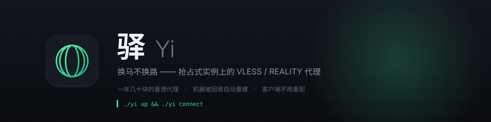
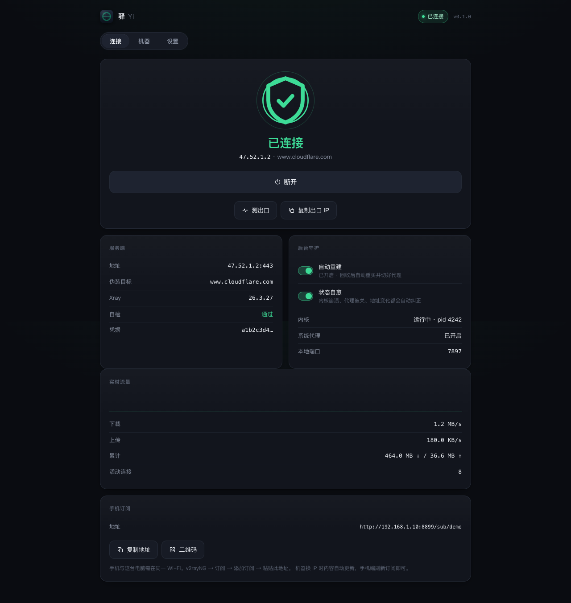

<p>
  <a href="https://github.com/cinqs/yi/actions/workflows/ci.yml"></a>
  <a href="https://cinqs.github.io/yi"></a>
  <a href="LICENSE"></a>
  
  
  
  
  <a href="https://github.com/cinqs/yi/wiki"></a>
</p>

**驿 (Yi)** 帮你用**一年几十块**跑起一台属于自己的代理：

```bash
./yi up        # 买香港竞价实例 → 装好 Xray → 输出客户端配置
./yi connect   # 起代理内核 + 开系统代理
```

名字取自古代**邮驿**制度——文书传递靠沿途驿站**换马续行**，人马不断、驿路不绝。
这里换的是被阿里云回收的抢占式实例：**机器换了，你的连接不换**。



## 为什么值得一看

常见教程是"买台 VPS，跑个安装脚本"。那套东西到了**抢占式实例**上会立刻崩：
机器随时被回收，IP 变了、密钥变了、客户端配置全废。

这个项目认真处理了这些事：

| 问题 | 做法 |
|---|---|
| 抢占式实例随时被回收 | 声明式期望状态 + **调和循环**：内核崩了、地址变了、系统代理被人关了，8 秒内自己纠正 |
| 回收后客户端要重新配置 | **凭据持久化**（UUID + REALITY 密钥对），重建出来对客户端仍是"同一台" |
| 不知道卡在哪一步 | 后端日志映射成**真实阶段**推给界面，不是假动画 |
| 机器没了顺带断网 | **绝不把系统代理指向没人监听的端口**；内核起不来就自动回退直连 |
| 伪装域名选不好会连不上 | 伪装目标按候选列表**逐个实测**，用第一个真正通的 |

## 它是什么

```
┌────────────── 驿 · Yi.app（不到 1 MB，Swift + WKWebView）──────────────┐
│  连接    机器    设置                                                │
└───────────────────────────┬──────────────────────────────────────────┘
                            │ HTTP + SSE（只监听 127.0.0.1）
┌───────────────────────────▼──────────────────────────────────────────┐
│  agent（Python 3.12，零第三方依赖）                                   │
│    ├── 生命周期：创建 / 销毁 / 竞价回收自愈                           │
│    ├── 调和循环：把实际状态收敛到期望状态                             │
│    └── 事件流：状态一变 187ms 内推给界面                              │
└───────────────────────────┬──────────────────────────────────────────┘
                            │
          ┌─────────────────┴──────────────────┐
          ▼                                    ▼
   阿里云 ECS（香港 · 竞价）              mihomo 内核（本地代理）
   出价 = 市场价 × 1.5，含 1 小时保护期
```

## 快速开始

### 1. 准备

- 阿里云账号（已实名），建一个 RAM 子账号并授予 ECS 权限
- macOS 11+，装好 [uv](https://docs.astral.sh/uv/)

```bash
git clone https://github.com/cinqs/yi && cd yi
make setup                       # Python 3.12 + 虚拟环境
./tools/set-credentials.sh       # 交互式写入 AccessKey（不回显、不进 shell 历史）
```

### 2. 先体检（不花钱）

```bash
./yi doctor --api     # 凭据 / 权限 / 交换机 / 安全组 / 镜像 / 竞价价格 逐项核对
./yi up --dry-run     # 看它打算买什么
```

### 3. 开干

```bash
./yi up               # 约 3 分钟：买机器 → 装服务端 → 回环自检 → 生成客户端配置
./yi fetch-kernel     # 首次需要：取一份代理内核（约 15 MB，不入库）
./yi connect          # 连接（系统代理免密码设置）
./yi status           # 状态与出口 IP
./yi disconnect       # 断开并还原系统代理
./yi down             # 销毁，停止计费
```

图形界面：

```bash
make app && open dist/Yi.app
```

## 命令行

| 命令 | 说明 |
|---|---|
| `yi up` / `down` | 创建 / 销毁（中途失败自动回滚，不留计费资源） |
| `yi connect` / `disconnect` | 起停代理内核 + 系统代理 |
| `yi fetch-kernel` | 下载代理内核 mihomo（不入库，用到才取；`--url` 可绕墙） |
| `yi android` | 取一份 Android 客户端 APK（v2rayNG 官方原版） |
| `yi rules` | 社区分流规则集：看状态 / `--update` 一键更新 |
| `yi status` / `proxy-status` | 机器、连接、出口 IP |
| `yi sub` | 重新生成客户端配置（v2rayNG 订阅 / Clash / sing-box） |
| `yi selftest` | 在服务器上回环自测：自己当客户端连自己 |
| `yi watch` | 常驻守护：机器被回收自动重买并切好代理 |
| `yi doctor` | 本地与云端逐项体检 |

## 客户端

**Android**：`./yi android` 会把 v2rayNG 的官方 APK 取到 `~/Downloads/yi-android/`
——GitHub Releases 国内常常打不开，这一步就是替你跨过去。装好后用界面上的二维码
或下面的订阅导入即可。

`yi up` 会在 `~/.config/yi/profiles/` 生成：

| 文件 | 用途 |
|---|---|
| `v2rayng-subscription.txt` | Android：v2rayNG → `+` → 从剪贴板导入 |
| `mihomo.yaml` | macOS：Clash Verge Rev 配置 |
| `singbox.json` | sing-box 1.11+ |
| `vless-link.txt` | 通用链接（可扫码） |

界面里还有**手机订阅**入口：本机起一个只读订阅端点，手机在同一 Wi-Fi 下订阅一次，
以后机器换 IP 时订阅内容自动更新——不需要域名、不需要对象存储、零成本。

## 成本

| 项 | 量级 |
|---|---|
| 香港竞价实例 2C2G | 约 ¥0.02–0.05 / 小时（实测出价 0.03） |
| 公网流量（按量计费） | 约 ¥0.5–0.8 / GB |

个人用法（每天几小时 + 几十 GB）大约**每月 ¥20–50**。所有资源带 `ttl` 标签，
`yi status` 显示已运行时长与累计流量，`budget` 到阈值会告警。

## 文档

**上手**：[快速开始](docs/quickstart.md) · [配置参考](docs/configuration.md) ·
[常见问题](docs/faq.md) · [故障排查](docs/troubleshooting.md)

**理解它**：[架构与设计决策](docs/architecture.md) · [界面设计系统](docs/design.md) ·
[路线图](docs/roadmap.md)（含**明确不做**的事）

**为什么长这样**：[**踩坑记录**](docs/lessons.md) —— 真机上真实踩到的坑，含根因与回归测试；
[开发纪事](docs/history.md) —— 按时间顺序的完整日志。

**参与**：[贡献指南](CONTRIBUTING.md) · [发版检查单](docs/RELEASE.md) ·
[安全策略](SECURITY.md) · [行为准则](CODE_OF_CONDUCT.md)

全部文档见 **[文档索引](docs/README.md)**。

也可以看 [Wiki](https://github.com/cinqs/yi/wiki)（按问题组织，比 docs 更适合
"我就想赶紧用起来"），或 [GitHub Pages 站点](https://cinqs.github.io/yi)。

## 路线图

- [x] 竞价实例 + 保护期 + 自动起停 + 自动分配公网 IP
- [x] VLESS + XTLS-Vision + REALITY（伪装目标自动实测选择）
- [x] 声明式期望状态 + 调和自愈
- [x] 凭据持久化（重建后客户端不用重配）
- [x] macOS 原生 App + 手机订阅
- [ ] 抗墙自动处置：端口被封换端口、SNI 被封换伪装目标、IP 被封换 IP
- [ ] 手机订阅的异地稳定入口（对象存储）

## 贡献

欢迎 issue 和 PR。动手前请读 [CONTRIBUTING.md](CONTRIBUTING.md)；
提交前跑 `make check`：脱敏检查 → 文档链接 → 界面脚本语法 → ruff → 134 个单元测试。

改界面的话，光跑测试不算验证——这个项目出过 6 个 GUI bug，单元测试一个都抓不到。
`AGENTS.md` 里写了怎么用 playwright 真打开、真点、真截图。

## 许可

[MIT](LICENSE)。仅供个人自有服务器的网络用途；
请自行确认所在地与账号所属地对跨境代理服务的适用规定。
